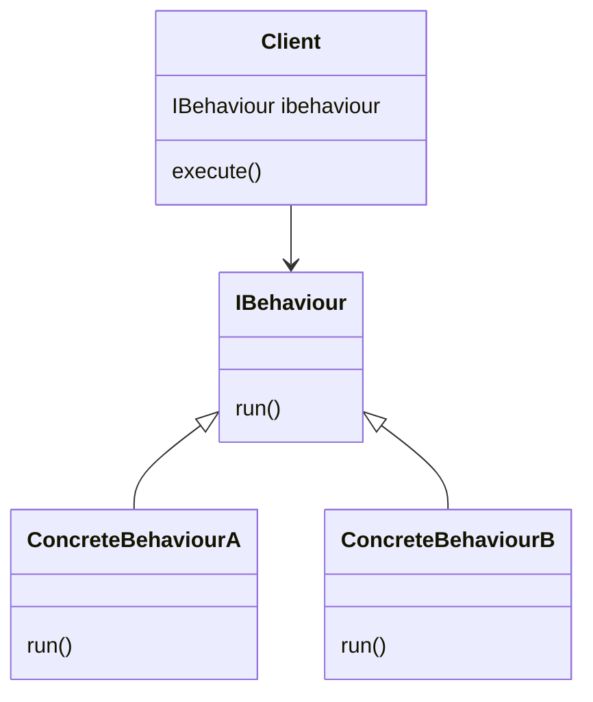
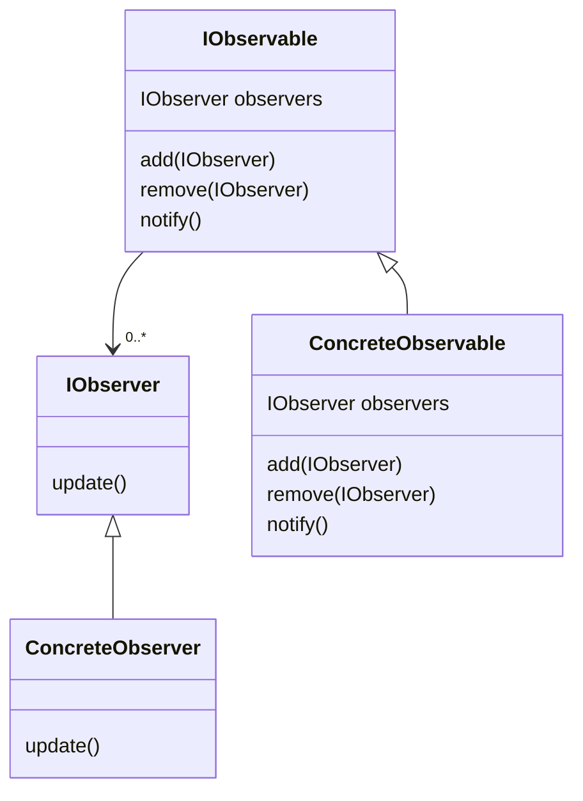
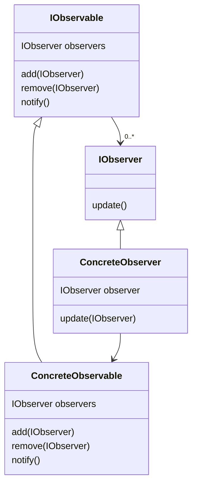

# Behaviorálne návrhové vzory

## Strategický vzor
- spočíva v kapsulovaní algoritmov a separovaní ich od tried, v ktorých sa používajú
- jeho výhodou je znovapoužívanie algoritmov medzi podtriedami supertried
	- niekedy môžeme dosiahnúť aj úplné zrušenie podtried a nahradiť ich kombináciou kapsulovaných algoritmov
- UML na zobrazenie:

## Sledovatelský vzor
(Observer Pattern)
- používa sa ak chceme niektoré objekty (sledovatľov) upozorniť o zmene stavu určitého objektu (sledovanca)
- sledovanec má svoju skupinu sledovateľov, ktorých po zmene, resp. nadobudnutí určitého stavu informuje
- UML diagram:

- !pozor, z tohto diagramu vychádza však, že aj keď je sledovateľ oznámený o zmene stavu sledovanca, nemusí presne vedieť čo a ako sa zmenilo, preto je možné dať v konštruktore referenciu na sledovanca:

- !pozor, podľa kódu je možné, že sledovanec bude samostatný objekt, ktorý vykonáva svoju činnosť a taktiež slúži ako sledovanec, ktorý informuje svojich sledovateľov, jednoducho povedané náš ConcreteObserver bude porušovať [[Princípy programovania#Princíp jednej zodpovednosti|princíp jednej zodpovednosti]]
	- je možné to napríklad zmenou IObservable z rozhrania na abstraktnú triedu a implementovania jednotlivých služieb zodpovedných za správu sledovateľov do nej